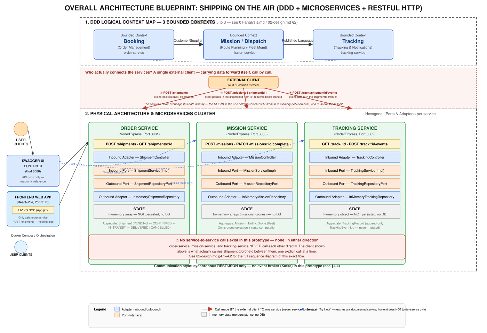
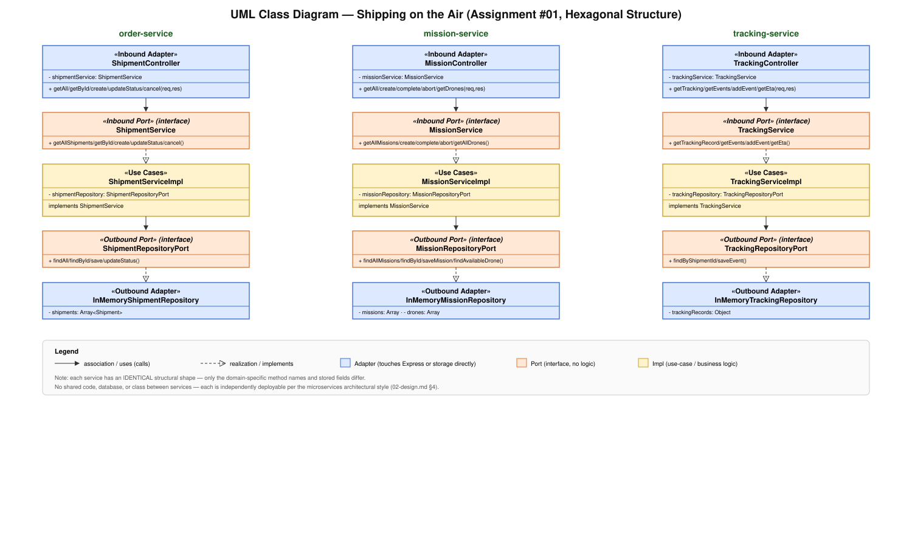

# ✈️ Shipping on the Air

> Autonomous drone package delivery platform — Assignment #01
> **Version:** `v1.0.0` · Course Project · DDD + Microservices Architecture

---

## 💡 Overview

**Shipping on the Air** is a distributed, event-driven platform designed for automated autonomous drone logistics.

### Key Features

* **Smart Booking:** Onboard shipments with distinct physical specifications and time constraints.
* **Automated Dispatching:** Dynamically matches optimal drones and generates 3D flight waypoints.
* **Live Telematics:** High-frequency tracking with sub-resource ETA calculations and checkpoint logs.
* **Resilient Operations:** Built-in flight safety overrides (In-flight Route Abort / Return-to-Base).

The platform applies **Domain-Driven Design (DDD)** principles to orchestrate decentralized, event-driven microservices.

---






## 📂 Repository Structure

```text
shipping-on-the-air/
├── openapi.yaml                 ← Unified API specification (OpenAPI 3.0)
├── docker-compose.yml           ← Service orchestrator
├── frontend/                    ← React Web App (Prototype UI + Living Doc)
│   ├── src/
│   │   └── App.jsx
│   └── package.json
└── services/
    ├── order-service/           ← Manages shipment lifecycle (Port 3001)
    ├── tracking-service/        ← Live telematics & event streams (Port 3002)
    └── mission-service/         ← Fleet dispatches & flight routes (Port 3003)

```

---

## 🚀 Quick Start & Environment Setup

### Option A — Frontend Prototype Only

```bash
cd frontend
npm install && npm run dev

```

🌐 **URL:** [http://localhost:5173](https://www.google.com/search?q=http://localhost:5173)

### Option B — Complete Microservice Infrastructure (Docker)

Spin up the complete ecosystem alongside an isolated interactive global documentation suite:

```bash
docker compose up --build -d

```

### 🛰️ Cluster Port Allocation

| Service Component | Internal Domain URI | Purpose |
| --- | --- | --- |
| **API Documentation** | [http://localhost:8080](https://www.google.com/search?q=http://localhost:8080) | Interactive Swagger UI API Engine |
| **Frontend UI** | [http://localhost:5173](https://www.google.com/search?q=http://localhost:5173) | Living document & simulation interface |
| **Order Service** | [http://localhost:3001](https://www.google.com/search?q=http://localhost:3001) | Core booking & shipment records |
| **Tracking Service** | [http://localhost:3002](https://www.google.com/search?q=http://localhost:3002) | Telematics ledger & event ingestion |
| **Mission Service** | [http://localhost:3003](https://www.google.com/search?q=http://localhost:3003) | Flight path calculation & asset tracking |

---

## 🏗️ Architectural Topology

The system is derived from **3 Bounded Contexts**, identified via Domain-Driven
Design and each mapped 1:1 to a microservice. Services currently communicate over
**synchronous REST/JSON** — see [`docs/02-design.md §4`](./docs/02-design.md) for
the full rationale and the documented path toward event-driven integration.

| Bounded Context | Microservice Owner | Core Domain Responsibility |
| --- | --- | --- |
| **Booking** | `order-service` | Shipment ingestion, validation, and lifecycle/status transitions. |
| **Mission / Dispatch** | `mission-service` | Drone selection, route (waypoint) computation, and fleet management. |
| **Tracking** | `tracking-service` | Live location, ETA, delivery progress, and the chronological event log. |

> **Note on scope:** this prototype intentionally uses in-memory state and direct
> REST calls rather than a database or message broker, to keep focus on the
> architecturally relevant parts of the assignment. These trade-offs — and where a
> production system would introduce PostgreSQL and Kafka — are documented explicitly
> in [`docs/01-analysis.md §4`](./docs/01-analysis.md) and referenced as code comments
> (e.g. `// In production: publish ShipmentPlaced event to Kafka here`).

---

## 📐 Diagrams

Visual reference material — UML structure, domain model, sequence, and use cases —
kept in [`docs/diagrams/`](./docs/diagrams/):

| Diagram | File | Shows |
| --- | --- | --- |
| UML Class Diagram | [`uml-class-diagram-a1.svg`](./docs/diagrams/uml-class-diagram-a1.svg) | Hexagonal structure (Controller → Port → Impl → Repository Port → Adapter) for all 3 services |
| UML Domain Model | [`uml-domain-model-a1.svg`](./docs/diagrams/uml-domain-model-a1.svg) | Aggregates, entities, and value objects per bounded context (§3 tactical design) |
| Sequence Diagram | [`sequence-diagram-a1.svg`](./docs/diagrams/sequence-diagram-a1.svg) | The actual, current shipment lifecycle — every step is client-triggered (see §4.1 in `02-design.md`) |
| Use Case Diagram | [`use-case-diagram-a1.svg`](./docs/diagrams/use-case-diagram-a1.svg) | Customer / System Operator actors and the 9 use cases across all 3 services |

Formal use case descriptions and user stories are in
[`docs/user-stories-and-use-cases-a1.md`](./docs/user-stories-and-use-cases-a1.md).

---

## 🧱 Internal Service Architecture

On top of the microservices architecture above, **each of the three services is
internally structured as a hexagon (ports & adapters)**. This is a deliberate
refinement layered on top of what the assignment requires (DDD + microservices),
following the same internal shape the course material uses for typical microservices:

```
Inbound Adapter (Express Controller)
        │  calls
        ▼
Inbound Port (Service interface)  ◄───implements─── Inbound Port Impl (use cases)
        │  calls
        ▼
Outbound Port (Repository interface)  ◄───implements─── Outbound Adapter (In-Memory Repository)
```

| Hexagonal role | order-service | tracking-service | mission-service |
| --- | --- | --- | --- |
| Inbound adapter | `ShipmentController` | `TrackingController` | `MissionController` |
| Inbound port | `ShipmentService` | `TrackingService` | `MissionService` |
| Inbound port impl. (use cases) | `ShipmentServiceImpl` | `TrackingServiceImpl` | `MissionServiceImpl` |
| Outbound port | `ShipmentRepositoryPort` | `TrackingRepositoryPort` | `MissionRepositoryPort` |
| Outbound adapter | `InMemoryShipmentRepository` | `InMemoryTrackingRepository` | `InMemoryMissionRepository` |

Both the inbound and outbound side follow the same interface/implementation pattern —
controllers and use-case classes only ever depend on the port (the abstract
interface), never on a concrete implementation directly. This keeps each service's
business logic swappable and unit-testable independently of Express or the in-memory
store, and would allow, for example, `InMemoryShipmentRepository` to be replaced with
a Postgres-backed implementation without touching the controller or use-case classes.

See the UML Class Diagram above for a visual rendering of this exact table.

---

## 🛠️ Technology Ecosystem

* **Frontend:** React + Vite (SPA)
* **Backend Services:** Node.js + Express.js
* **Database Engine:** PostgreSQL (Isolated per microservice context)
* **Asynchronous Bus:** Apache Kafka (Distributed Domain Event Logs)
* **Containerization:** Docker + Docker Compose v2
* **API Standards:** OpenAPI 3.0 Specification (Swagger rendering)

---

## 📖 The "Living Document"

The code inside `frontend/src/App.jsx` acts as the project's executable **living documentation**, combining blueprint models directly with operational software:

* ✅ Functional & Non-Functional Requirements Matrix
* ✅ **Ubiquitous Language Glossary** for logistics-drones alignment
* ✅ Aggregate boundaries & Entity definition blocks
* ✅ Vectorized **Bounded Context Map** (SVG Blueprint)
* ✅ Integrated Kafka Domain Event Catalog
* ✅ Live simulation sandbox tracking `SHP-001`, `MSN-001`, and `DRN-07`

---

## 🎥 Demonstration

> 📹 **[Watch the Demo Video Layout](https://www.dropbox.com/scl/fi/1becrag01jx1qj3cpg30j/assignment1.mov?rlkey=ggwncsoz2utou43kwsal2vxza&st=ioamdqi1&dl=0)** 

---

## 👥 Project Team

* Mary Anne Selirio maryanne.selirio@studio.unibo.it
* Dias Katrenov dias.katrenov@studio.unibo.it
* Danial Khayatian danial.khayatian@studio.unibo.i
