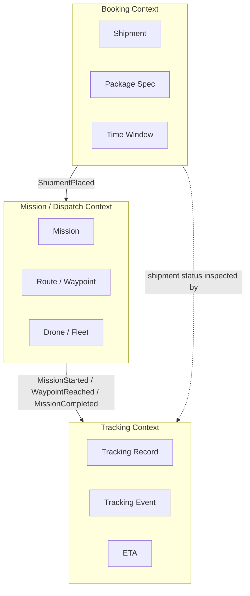
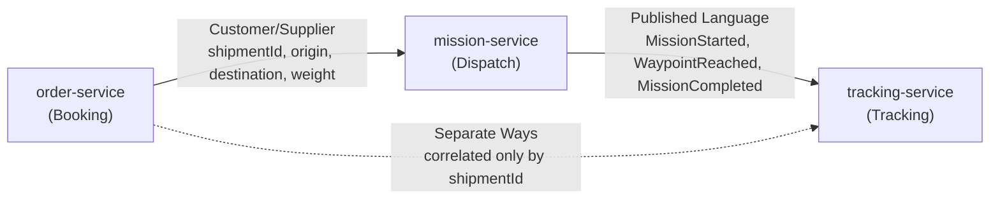
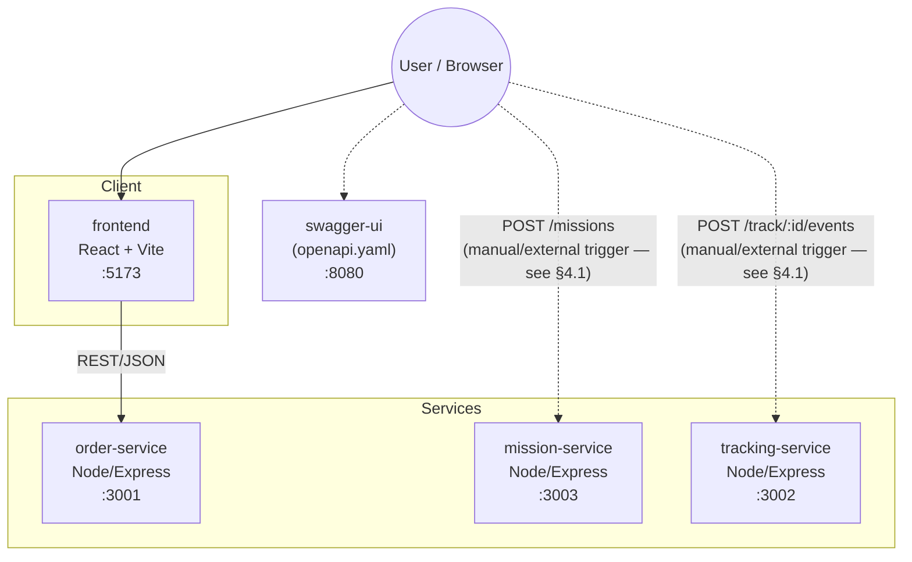
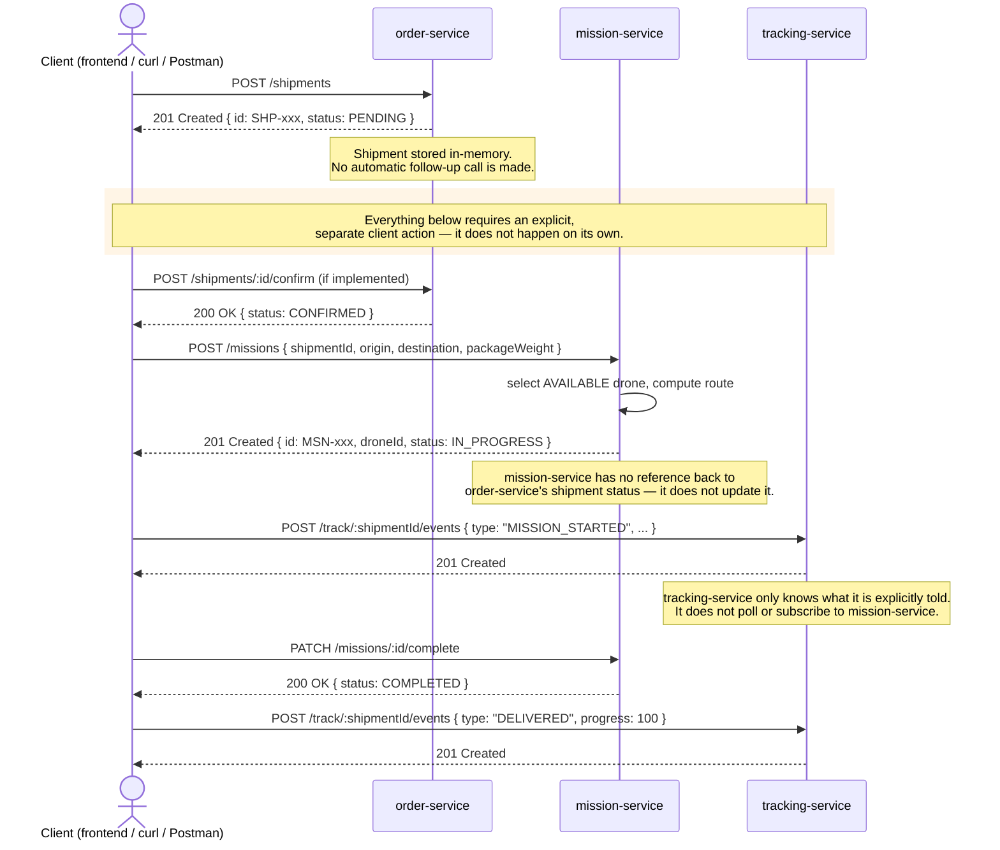
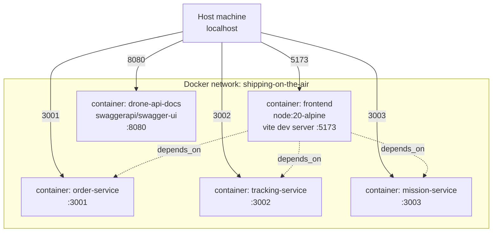
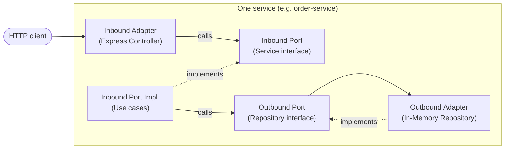

# 02 — Design

> Shipping on the Air — Assignment #01, Software Architecture and Platforms, a.y. 2025-2026

This document covers the **Domain-Driven Design** (strategic + tactical) used to derive
the domain model from the requirements in [01-analysis.md](./01-analysis.md), and the
resulting **microservices architecture**.

---

## 1. Ubiquitous Language

| Term | Meaning |
|---|---|
| **Shipment** | A customer's request to move a package from an origin to a destination within a time window. |
| **Package spec** | Physical characteristics of the package relevant to delivery (weight, fragility). |
| **Time window** | Earliest/latest acceptable delivery time requested by the customer. |
| **Mission** | The operational act of a specific drone flying a specific route to fulfil a shipment. |
| **Route / Waypoint** | The ordered sequence of geographic points a drone follows during a mission. |
| **Drone** | A fleet vehicle with a payload capacity, battery level, and availability status. |
| **Tracking record** | The live state of a shipment in transit: current location, ETA, progress, event log. |
| **Tracking event** | A timestamped fact appended to a tracking record (e.g. `WAYPOINT_REACHED`). |
| **ETA** | Estimated time of arrival, derived from mission progress. |

This vocabulary is used consistently across code (variable/route names), the OpenAPI
spec, and this document — this is what "ubiquitous" means in DDD: the same words are
used by domain experts, docs, and code.

---

## 2. Strategic Design: Bounded Contexts

Three bounded contexts are identified, directly reflecting the three concerns
identified in the analysis (booking, dispatching, observing):



Each bounded context maps 1:1 onto a microservice:

| Bounded Context | Microservice | Responsibility |
|---|---|---|
| Booking | `order-service` | Owns the shipment lifecycle: create, read, update status, cancel. |
| Mission / Dispatch | `mission-service` | Owns drone assignment and route computation; owns the fleet. |
| Tracking | `tracking-service` | Owns live position, ETA, progress and the event history. |

### Context Map

The relationships between contexts, using standard DDD context-mapping patterns:

- **Booking → Mission**: *Customer/Supplier*. Booking is the upstream trigger
  (a placed shipment is what causes a mission to be created), but Mission does not
  need to know Booking's internals — only the minimal data (`shipmentId`, `origin`,
  `destination`, `packageWeight`) needed to dispatch.
- **Mission → Tracking**: *Published Language*. Mission emits well-known event types
  (`MISSION_STARTED`, `WAYPOINT_REACHED`, ...) that Tracking consumes and appends to
  its own record, without Tracking needing to understand Mission's internal route
  model.
- **Booking ↔ Tracking**: *Separate Ways* (data-wise). They share only the
  `shipmentId` as a correlation key; a user-facing view stitches both together, but
  neither context depends on the other's schema.



**Important note on the arrows above:** these describe the *conceptual* context
relationships — what data/events *would* flow between contexts in a fully realised
system. See §4.1 below for exactly which of these are actually automated by code in
this prototype, versus which require an explicit external trigger.

---

## 3. Tactical Design

### 3.1 Booking context (`order-service`)

- **Aggregate root:** `Shipment`
  - Identity: `id` (e.g. `SHP-001`)
  - Value objects: `Location {address, lat, lon}`, `PackageSpec {weight, fragile}`,
    `TimeWindow {earliest, latest}`
  - State: `status ∈ {PENDING, CONFIRMED, IN_TRANSIT, DELIVERED, CANCELLED}`
- **Domain events raised:** `ShipmentPlaced`, `ShipmentStatusChanged`, `ShipmentCancelled`
- **Invariants enforced:** a shipment cannot be created without `origin`,
  `destination`, and `packageSpec`; status transitions are restricted to a known set.

### 3.2 Mission/Dispatch context (`mission-service`)

- **Aggregate root:** `Mission`
  - Identity: `id` (e.g. `MSN-001`)
  - References `shipmentId` (from Booking) and `droneId` (from the fleet)
  - Value object: `Route { waypoints: [Waypoint] }`, `Waypoint {order, lat, lon, alt, label}`
  - State: `status ∈ {IN_PROGRESS, COMPLETED, ABORTED}`
- **Entity:** `Drone {id, model, battery, maxPayload, status}` — part of the Fleet,
  not the Mission aggregate itself, since drones outlive any single mission.
- **Domain events raised:** `MissionStarted`, `MissionCompleted`, `MissionAborted`
- **Invariants enforced:** a mission can only start with a drone that is `AVAILABLE`,
  has battery above a safety threshold, and whose `maxPayload` covers the package
  weight; completing/aborting a mission always releases the drone back to `AVAILABLE`.

### 3.3 Tracking context (`tracking-service`)

- **Aggregate root:** `TrackingRecord`
  - Identity: `shipmentId` (correlation key shared with Booking, not a foreign key)
  - State: `currentLocation`, `eta`, `progress`, `droneId`
  - Contains: ordered list of `TrackingEvent {timestamp, type, description}`
- **Domain events consumed:** anything Mission publishes; appended as `TrackingEvent`s
- **Invariants enforced:** events are always appended (never mutated/deleted),
  preserving an audit trail of the delivery.

---

## 4. Microservices Architecture

Each bounded context is realised as an independently deployable Node.js/Express
service with its own container, matching the "one service per bounded context"
principle used to keep service boundaries aligned with domain boundaries (avoiding
both a monolith and an overly-fragmented, anemic split).



### 4.1 What is and isn't automated in this prototype

**This is important and is stated explicitly here to avoid any ambiguity:**
`order-service` does **not** automatically call `mission-service` when a shipment is
placed, and `mission-service` does **not** automatically call `tracking-service` when
a mission starts. Each service only exposes its own REST API; nothing in the code
performs the cross-service call implied by the conceptual context map in §2.

Concretely, a shipment created via `POST /shipments` will remain in `PENDING`
indefinitely unless a client (a human tester, a script, or in a production system: an
orchestrator or event consumer) explicitly issues the follow-up calls:
`POST /missions` (dispatch) and `POST /track/:id/events` (tracking update).

**This is a deliberate scope decision for the prototype, not an oversight:**
implementing real cross-service dispatch — whether via direct synchronous calls or,
preferably, via an event broker as described below — was judged out of scope for
Assignment #01, whose primary focus (per the assignment brief) is the DDD analysis and
the microservices decomposition itself, not full inter-service orchestration. The
sequence diagram in §4.2 documents the actual, current step-by-step flow, driven by an
external client rather than automatically by the services.

A production system would close this gap in one of two ways, both consistent with the
domain event model already defined in §2–3: (a) `order-service` synchronously calling
`mission-service`'s API directly, or (b) publishing `ShipmentPlaced` as a real event to
a broker (see the Kafka discussion in §4.4) for `mission-service` to consume
independently — the latter is the direction taken in Assignment #03.

### 4.2 Sequence diagram: actual current behavior

This shows the real, current step-by-step flow — an external client (a person testing
the API, a script, or the frontend for the one step it covers) drives every
transition. No arrow below happens without an explicit request from outside the
services.



### Deployment view (Docker Compose)

All five components run as separate containers on a shared Docker network, orchestrated
by `docker-compose.yml`, so the whole distributed system starts with one command
(`docker compose up --build -d`) — satisfying NFR-7 (local reproducibility).



### 4.4 Communication style

The current prototype uses **synchronous REST/JSON** for every API, and — per §4.1 —
does not itself chain calls between services; each cross-context transition (dispatch,
tracking update) is triggered explicitly by whatever client is driving the system.

This is a deliberate, documented simplification: the DDD context map in §2 (e.g.
"Published Language" between Mission and Tracking) implies that, in a complete system,
these transitions would happen automatically — either via direct service-to-service
calls or, architecturally preferably, via **event-driven** integration, decoupling
publishers from subscribers and improving the partial-failure tolerance required by
NFR-3. The code already marks this intended seam explicitly, e.g.:

```js
// In production: publish ShipmentPlaced event to Kafka here
```

A production evolution would introduce a message broker (e.g. Kafka) and have
`order-service` and `mission-service` publish domain events rather than requiring an
external client to chain the calls, with `tracking-service` (and any future consumer)
subscribing independently. **This is exactly the direction taken in Assignment #03**,
where `order-service` publishes `OrderCreated` to Kafka and a dedicated
`shipment-orchestrator` service consumes it automatically.

### API contracts

The shared contract between the frontend and all three services is captured formally
in [`openapi.yaml`](../openapi.yaml) at the repository root, and served as interactive
documentation via Swagger UI on port `8080` — this is the "explicit, stable contract"
required by NFR-5, versioned in the same repository as the code that implements it.

---

## 5. Internal Service Architecture: Hexagonal (Ports & Adapters)

Section 4 covers the **system-level** architectural style (microservices, derived
from the bounded contexts in §2). This section covers a **different, more granular**
level: how the code *inside* each individual service is organised.

Each of the three services (`order-service`, `mission-service`, `tracking-service`)
is internally structured as a hexagon:



| Hexagonal role | order-service | mission-service | tracking-service |
|---|---|---|---|
| Inbound adapter | `ShipmentController` | `MissionController` | `TrackingController` |
| Inbound port (interface) | `ShipmentService` | `MissionService` | `TrackingService` |
| Inbound port impl. (use cases) | `ShipmentServiceImpl` | `MissionServiceImpl` | `TrackingServiceImpl` |
| Outbound port (interface) | `ShipmentRepositoryPort` | `MissionRepositoryPort` | `TrackingRepositoryPort` |
| Outbound adapter | `InMemoryShipmentRepository` | `InMemoryMissionRepository` | `InMemoryTrackingRepository` |

**Why this is a separate decision from §4:** the assignment brief requires DDD and a
microservices architectural style — it does not prescribe how a service's own code is
internally organised. Hexagonal architecture here is an additional refinement,
applied uniformly across all three services, motivated directly by the course
material's own description of a typical microservice's "logical view architecture"
(business logic at the core, surrounded by inbound adapters that invoke it and
outbound adapters it invokes in turn).

**What it buys, concretely:**
- Controllers and use-case classes depend only on ports (interfaces), never on a
  concrete adapter directly — e.g. `ShipmentController` depends on `ShipmentService`,
  not on `ShipmentServiceImpl`.
- The in-memory repositories (`InMemoryShipmentRepository`, etc.) are swappable for a
  real database implementation of the same port with no change to controllers or
  use-case classes — directly relevant to the persistence simplification noted in
  `01-analysis.md §4`.
- Business logic in each service is unit-testable independently of Express and of the
  in-memory store.

This is orthogonal to and does not replace the microservices architecture in §4 — it
is the internal structure *within* each of the three already-identified services.

---

## 6. Traceability Summary

| Requirement | Bounded Context | Service |
|---|---|---|
| FR-1..4 | Booking | `order-service` |
| FR-5, FR-6, FR-9 | Mission/Dispatch | `mission-service` |
| FR-7, FR-8 | Tracking | `tracking-service` |
| NFR-1, NFR-2, NFR-3 | — (cross-cutting) | service boundary design |
| NFR-4 | — (cross-cutting) | domain event design (§3); current manual-trigger limitation documented in §4.1 |
| NFR-5 | — (cross-cutting) | `openapi.yaml` |
| NFR-6 | Tracking | `tracking-service` |
| NFR-7 | — (cross-cutting) | `docker-compose.yml` |
