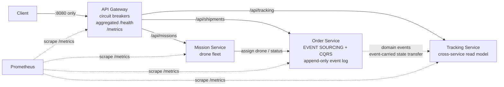

# Shipping on the Air — Assignment #02 Report
### Applying Microservices Patterns

**Course:** Software Architecture and Platforms, a.y. 2025–2026
**Builds on:** Assignment #01 (Shipping on the Air — DDD + microservices prototype)

---

## 1. Overview

Assignment #01 delivered a DDD-based microservices prototype with three services (Order, Tracking, Mission) exposed directly to clients. Assignment #02 refines that design, implementation and deployment by applying six microservices patterns:

| # | Pattern | Where it lives |
|---|---------|----------------|
| 1 | **API Gateway** | new `gateway/` service — single entry point on `:8080` |
| 2 | **Health Check API** (observability) | `/health` on every service + *aggregated* health on the gateway |
| 3 | **Application Metrics** (observability) | `/metrics` (Prometheus format) on every service, scraped by Prometheus |
| 4 | **Event Sourcing** | applied to the **Order Service** — shipment state is derived from an append-only event log |
| 5 | **CQRS** *(chosen pattern 1)* | Order Service write/read model split + Tracking Service as a cross-service read model |
| 6 | **Circuit Breaker** *(chosen pattern 2)* | in the gateway, one breaker per upstream service |



---

## 2. The patterns, architecturally

### 2.1 API Gateway
Clients of A#01 had to know three hosts/ports and their internal APIs. The gateway (`gateway/index.js`) restores encapsulation: it is the **only** published endpoint (`:8080`), routes `/api/*` prefixes to the right upstream, and is the natural seat for cross-cutting concerns — here resilience (circuit breakers) and observability (aggregated health, edge metrics). Internal services can now be re-deployed, moved or scaled without any client change; this is precisely the seam that Assignment #03 exploits when it swaps HTTP integration for Kafka.

### 2.2 Health Check API
Every service exposes `GET /health` returning liveness plus dependency detail (event-store size, tracked shipments, idle drones). The gateway's `/health` **fans out** to all upstream health endpoints and aggregates them into a single platform status (`UP` / `DEGRADED`, HTTP 200/503). This one endpoint serves humans, container orchestrators (compose/Kubernetes probes) and monitoring alike.

### 2.3 Application Metrics
Each service instruments itself with `prom-client` and exposes `GET /metrics`. Beyond runtime defaults we publish domain-meaningful signals:

- `gateway_request_duration_seconds` (histogram) & `gateway_http_requests_total` — RED metrics at the edge;
- `gateway_circuit_breaker_state` (0=CLOSED, 1=HALF_OPEN, 2=OPEN) & transition counter;
- `order_service_events_appended_total{event_type}` — business throughput;
- `order_service_event_publish_failures_total` — integration failures made visible;
- `tracking_service_events_consumed_total`, `mission_service_drones_available`.

Prometheus (in the compose stack, `infra/prometheus.yml`) scrapes all four services every 5 s.

### 2.4 Event Sourcing — applied to the Order Service
The Order Service no longer stores *current* shipment rows. The single source of truth is an **append-only event store** (`eventstore.js`, JSON-lines file on a Docker volume): `ShipmentPlaced`, `ShipmentConfirmed`, `DroneAssigned`, `ShipmentStatusChanged`, `ShipmentDelivered`, `ShipmentCancelled`.

- **Write path:** a command rehydrates the aggregate by replaying its stream (`rehydrate = events.reduce(evolve, initial)`), validates invariants (payload ≤ 5 kg, legal status transitions, no cancelling a delivered shipment) and appends exactly one new event (`domain/shipment.js` — pure functions, trivially unit-testable).
- **Consequences:** free audit trail (`GET /shipments/:id/events`), state reconstruction after any crash, and temporal queries for free; the trade-off is eventual consistency towards read models and the need for replay-tolerant consumers (unknown event types are ignored for forward compatibility).

### 2.5 CQRS (chosen pattern 1)
Event Sourcing makes reads awkward — replaying streams per query does not scale. So the read side is split off:

- **in-service:** `projection.js` folds every event into a denormalised *shipment view* map; all `GET` endpoints hit only this projection, never the log. Rebuilt from the log on boot — schema changes cost one replay.
- **cross-service:** the Tracking Service is a *separate* read model. The order service pushes every appended event to it (event-carried state transfer over HTTP); tracking maintains a timeline + ETA per shipment and answers customer queries with **zero** calls back to the write side.

### 2.6 Circuit Breaker (chosen pattern 2)
`gateway/circuit-breaker.js` implements the classic three-state machine (CLOSED → OPEN → HALF_OPEN), hand-rolled to keep the mechanics explicit: after 3 consecutive failures/timeouts (2 s call timeout) the circuit opens and the gateway **fails fast** with 503 — no connection pile-up, no cascading failure — then probes with a single trial request after 10 s. Breaker state is exported as a Prometheus gauge, so an open circuit is immediately visible on a dashboard.

**Demo** (reproduced in CI-style during development):
```
docker stop order-service
# 3 requests fail with 502 … then:
GET :8080/api/shipments → 503 {"error":"Service temporarily unavailable (circuit open)"}
docker start order-service   # ≤10 s later the half-open probe closes the circuit
```

---

## 3. Deployment strategy (containers)

Each service has its own `Dockerfile` (node:20-alpine, prod-deps only); `docker-compose.yml` composes the system:

- **one published entry point** — only the gateway must be exposed (`8080`); service ports are published solely for Prometheus/debugging convenience;
- **internal DNS-based wiring** via environment variables (`ORDER_URL=http://order-service:3001`, …) — twelve-factor config, no code change between environments;
- **stateful piece isolated:** the event log lives on the named volume `order-events`, so `docker compose restart` preserves all shipment history (event sourcing makes the rest of the state derivable);
- `depends_on` ordering + `restart: unless-stopped` for self-healing.

```
docker compose up --build     # gateway :8080, Prometheus :9090
```

---

## 4. Testing strategy — the test pyramid

| Level | Example | What it proves | Run |
|-------|---------|----------------|-----|
| **Unit** (many, ms-fast, no I/O) | `services/order-service/tests/unit.test.js` — aggregate: replay, invariants, illegal transitions; `gateway/tests/circuit-breaker.test.js` — breaker state machine | domain logic & resilience logic in isolation | `npm run test:unit` |
| **Integration** (few) | `services/order-service/tests/integration.test.js` — real Express app on an ephemeral port: commands via HTTP, projection consistency, event-stream audit, health check | routes + event store + projection wired correctly | `npm run test:integration` |
| **End-to-end** (one, slow) | `tests/e2e/e2e.test.js` — against the *dockerised* system, exclusively through the gateway: place → confirm → mission → track → deliver, checking both read models converge | the whole system delivers the business scenario | `docker compose up -d && node --test tests/e2e/e2e.test.js` |

All tests use Node's built-in `node:test` runner — zero test dependencies.

---

## 5. Observability patterns ⇒ Quality Attribute Scenarios

Observability is what turns QAS from prose into *measurable, falsifiable* statements: the metrics/health endpoints provide the **response measure** of each scenario.

### QAS-1 · Availability — surviving an order-service outage

| Part | Value |
|------|-------|
| Source | order-service container crash |
| Stimulus | upstream stops responding (connection refused / timeout) |
| Artifact | API gateway + order service |
| Environment | normal operation, production load |
| Response | gateway circuit opens; clients receive an immediate 503 with a meaningful payload instead of hanging; tracking queries (separate read model) keep working |
| **Response measure** | ≥ 99% of requests during the outage answered in < 100 ms (fail-fast); circuit re-closes ≤ 15 s after recovery |

**How observability implements it:** `gateway_circuit_breaker_state{upstream="order"}` shows exactly when the circuit opened/closed; `gateway_request_duration_seconds` verifies the fail-fast bound; the aggregated `/health` flips to `DEGRADED`/503, which is both the alert trigger and the verification signal in a fault-injection test (`docker stop order-service`). Meanwhile `tracking_service_http_requests_total{status_code="200"}` proves reads stayed available — evidence that CQRS bought partial availability.

### QAS-2 · Performance — placing a shipment under load

| Part | Value |
|------|-------|
| Source | customers via the public API |
| Stimulus | 50 req/s of `POST /api/shipments` for 5 minutes |
| Artifact | gateway + order service (command side) |
| Environment | normal operation |
| Response | every valid command is accepted, an event is appended, downstream read models converge |
| **Response measure** | p99 end-to-end latency < 500 ms; error rate < 0.1%; zero lost events |

**How observability implements it:**
```promql
histogram_quantile(0.99, sum(rate(gateway_request_duration_seconds_bucket{upstream="order"}[1m])) by (le))
```
gives the p99 directly; the error rate comes from `gateway_http_requests_total` by `status_code`; and "zero lost events" is checked by comparing `order_service_events_appended_total{event_type="ShipmentPlaced"}` with `tracking_service_events_consumed_total{event_type="ShipmentPlaced"}` — a *business-level* invariant that only application metrics (not infrastructure metrics) can express. `order_service_event_publish_failures_total > 0` pinpoints where the pipeline leaks if they diverge.

---

## 6. From A#01 to A#02 — and towards A#03

A#01 established the DDD model (bounded contexts, ubiquitous language, aggregates) and a naive deployment where clients coupled to every service. A#02 keeps the domain model intact and hardens the architecture: one entry point, failures contained, state auditable, everything measurable, all behaviour covered by a test pyramid. The remaining weak point — synchronous HTTP integration between services — is exactly what Assignment #03 addresses by re-engineering the integration around Kafka as an event log, a natural continuation since the order service already *thinks* in events.
