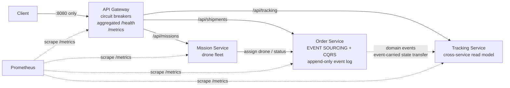
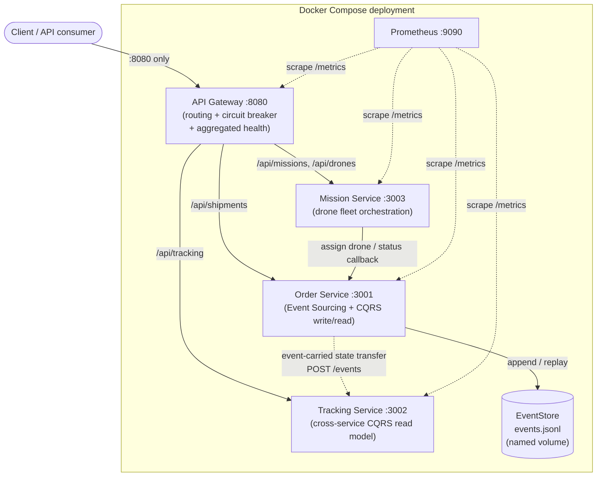
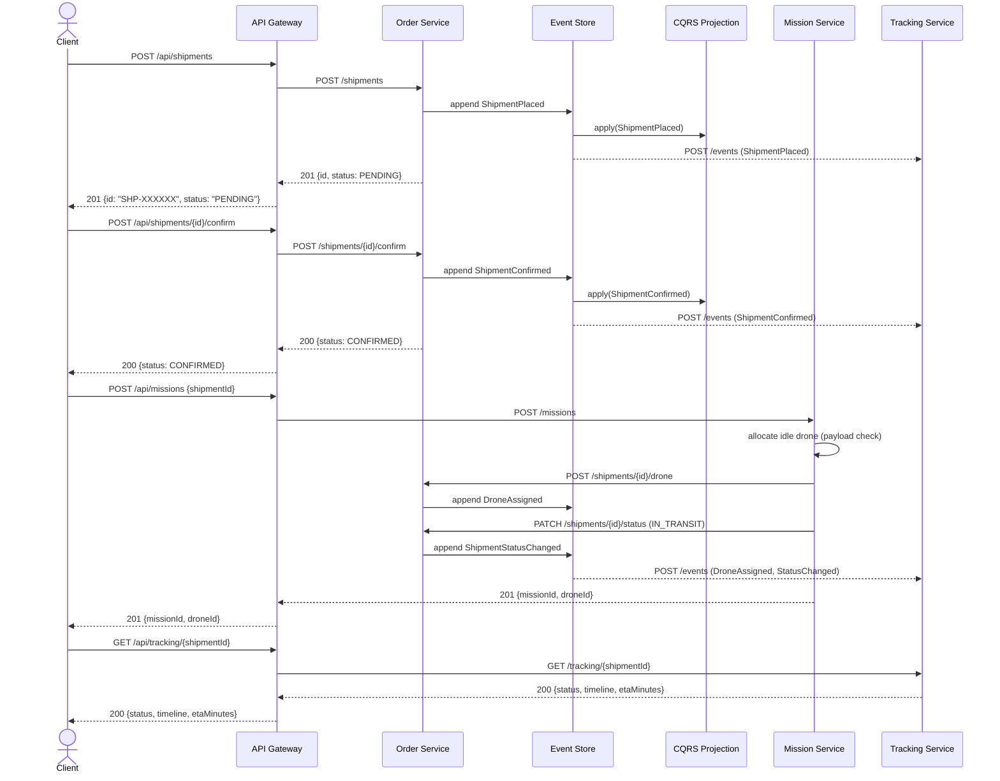
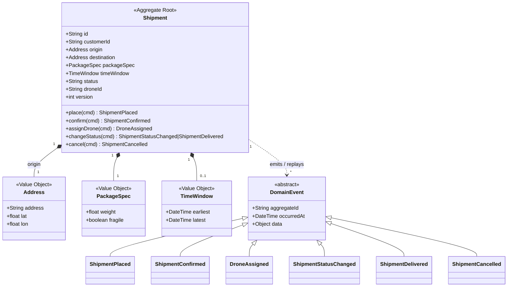
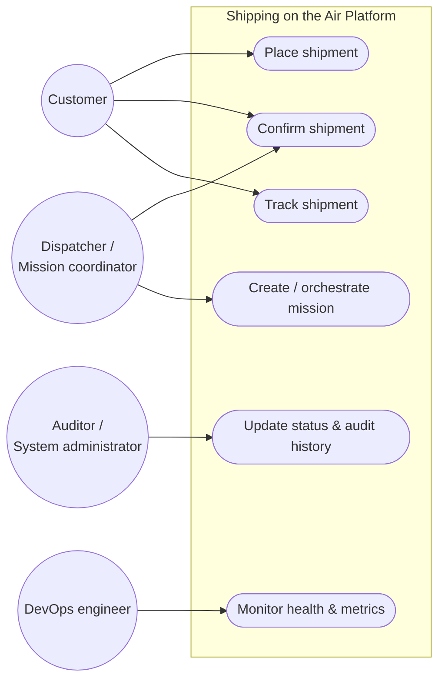

# Shipping on the Air Assignment #02 Report
### Applying Microservices Patterns

**Course:** Software Architecture and Platforms, a.y. 2025–2026
**Builds on:** Assignment #01 (Shipping on the Air — DDD + microservices prototype)

---

## 1. Overview

Assignment #01 delivered a DDD-based microservices prototype with three services (Order, Tracking, Mission) exposed directly to clients. Assignment #02 refines that design, implementation and deployment by applying six microservices patterns:

| # | Pattern | Where it lives |
|---|---------|----------------|
| 1 | **API Gateway** | new `gateway/` service — single entry point on `:8080` |
| 2 | **Health Check API** (observability) | `/health` on every service + *aggregated* health on the gateway |
| 3 | **Application Metrics** (observability) | `/metrics` (Prometheus format) on every service, scraped by Prometheus |
| 4 | **Event Sourcing** | applied to the **Order Service** — shipment state is derived from an append-only event log |
| 5 | **CQRS** *(chosen pattern 1)* | Order Service write/read model split + Tracking Service as a cross-service read model |
| 6 | **Circuit Breaker** *(chosen pattern 2)* | in the gateway, one breaker per upstream service |



---

## 2. The patterns, architecturally

### 2.1 API Gateway
Clients of A#01 had to know three hosts/ports and their internal APIs. The gateway (`gateway/index.js`) restores encapsulation: it is the **only** published endpoint (`:8080`), routes `/api/*` prefixes to the right upstream, and is the natural seat for cross-cutting concerns — here resilience (circuit breakers) and observability (aggregated health, edge metrics). Internal services can now be re-deployed, moved or scaled without any client change; this is precisely the seam that Assignment #03 exploits when it swaps HTTP integration for Kafka.

### 2.2 Health Check API
Every service exposes `GET /health` returning liveness plus dependency detail (event-store size, tracked shipments, idle drones). The gateway's `/health` **fans out** to all upstream health endpoints and aggregates them into a single platform status (`UP` / `DEGRADED`, HTTP 200/503). This one endpoint serves humans, container orchestrators (compose/Kubernetes probes) and monitoring alike.

### 2.3 Application Metrics
Each service instruments itself with `prom-client` and exposes `GET /metrics`. Beyond runtime defaults we publish domain-meaningful signals:

- `gateway_request_duration_seconds` (histogram) & `gateway_http_requests_total` — RED metrics at the edge;
- `gateway_circuit_breaker_state` (0=CLOSED, 1=HALF_OPEN, 2=OPEN) & transition counter;
- `order_service_events_appended_total{event_type}` — business throughput;
- `order_service_event_publish_failures_total` — integration failures made visible;
- `tracking_service_events_consumed_total`, `mission_service_drones_available`.

Prometheus (in the compose stack, `infra/prometheus.yml`) scrapes all four services every 5 s.

### 2.4 Event Sourcing — applied to the Order Service
The Order Service no longer stores *current* shipment rows. The single source of truth is an **append-only event store** (`eventstore.js`, JSON-lines file on a Docker volume): `ShipmentPlaced`, `ShipmentConfirmed`, `DroneAssigned`, `ShipmentStatusChanged`, `ShipmentDelivered`, `ShipmentCancelled`.

- **Write path:** a command rehydrates the aggregate by replaying its stream (`rehydrate = events.reduce(evolve, initial)`), validates invariants (payload ≤ 5 kg, legal status transitions, no cancelling a delivered shipment) and appends exactly one new event (`domain/shipment.js` — pure functions, trivially unit-testable).
- **Consequences:** free audit trail (`GET /shipments/:id/events`), state reconstruction after any crash, and temporal queries for free; the trade-off is eventual consistency towards read models and the need for replay-tolerant consumers (unknown event types are ignored for forward compatibility).

### 2.5 CQRS (chosen pattern 1)
Event Sourcing makes reads awkward — replaying streams per query does not scale. So the read side is split off:

- **in-service:** `projection.js` folds every event into a denormalised *shipment view* map; all `GET` endpoints hit only this projection, never the log. Rebuilt from the log on boot — schema changes cost one replay.
- **cross-service:** the Tracking Service is a *separate* read model. The order service pushes every appended event to it (event-carried state transfer over HTTP); tracking maintains a timeline + ETA per shipment and answers customer queries with **zero** calls back to the write side.

### 2.6 Circuit Breaker (chosen pattern 2)
`gateway/circuit-breaker.js` implements the classic three-state machine (CLOSED → OPEN → HALF_OPEN), hand-rolled to keep the mechanics explicit: after 3 consecutive failures/timeouts (2 s call timeout) the circuit opens and the gateway **fails fast** with 503 — no connection pile-up, no cascading failure — then probes with a single trial request after 10 s. Breaker state is exported as a Prometheus gauge, so an open circuit is immediately visible on a dashboard.

**Demo** (reproduced in CI-style during development):
```
docker stop order-service
# 3 requests fail with 502 … then:
GET :8080/api/shipments → 503 {"error":"Service temporarily unavailable (circuit open)"}
docker start order-service   # ≤10 s later the half-open probe closes the circuit
```

---

## 3. Deployment strategy (containers)

Each service has its own `Dockerfile` (node:20-alpine, prod-deps only); `docker-compose.yml` composes the system:

- **one published entry point** — only the gateway must be exposed (`8080`); service ports are published solely for Prometheus/debugging convenience;
- **internal DNS-based wiring** via environment variables (`ORDER_URL=http://order-service:3001`, …) — twelve-factor config, no code change between environments;
- **stateful piece isolated:** the event log lives on the named volume `order-events`, so `docker compose restart` preserves all shipment history (event sourcing makes the rest of the state derivable);
- `depends_on` ordering + `restart: unless-stopped` for self-healing.

```
docker compose up --build     # gateway :8080, Prometheus :9090
```

---

## 4. Testing strategy — the test pyramid

We follow a test pyramid: unit tests for the order-service aggregate and the gateway circuit breaker, integration tests for the order-service HTTP API and CQRS projection, and end-to-end tests that exercise the platform both through the API gateway and directly against each service.

| Level | Example | What it proves | Run |
|-------|---------|----------------|-----|
| **Unit** (many, ms-fast, no I/O) | `services/order-service/tests/unit.test.js` — aggregate: replay, invariants, illegal transitions, boundary weight, idempotent cancel; `gateway/tests/circuit-breaker.test.js` — breaker state machine, true fail-fast (no upstream call while OPEN), per-upstream isolation | domain logic & resilience logic in isolation | `npm run test:unit` |
| **Integration** (few) | `services/order-service/tests/integration.test.js` — real Express app on an ephemeral port: commands via HTTP, projection consistency, event-stream audit, health check | routes + event store + projection wired correctly | `npm run test:integration` |
| **End-to-end** (through the gateway) | `tests/e2e/e2e.test.js` — against the *dockerised* system, exclusively through the gateway: place → confirm → mission → complete → deliver, checking both read models converge and the drone is released | the whole system delivers the business scenario through its single entry point | `docker compose up -d && node --test tests/e2e/e2e.test.js` |
| **End-to-end** (direct-to-service) | `tests/e2e/full-lifecycle.test.js` — the identical journey, but calling order/tracking/mission services directly on `:3001`/`:3002`/`:3003`, bypassing the gateway | each service honours its own HTTP contract independently, and event-carried state transfer to tracking-service works with zero gateway involvement | `node --test tests/e2e/full-lifecycle.test.js` |
| **End-to-end** (load / contention) | `tests/e2e/concurrent-load.test.js` — fires more concurrent mission requests than idle drones exist | mission-service's fixed-size fleet degrades to clean `409`s under contention (never a crash, hang, or over-allocation), and self-cleans afterwards | `node --test tests/e2e/concurrent-load.test.js` |

All tests use Node's built-in `node:test` runner — zero test dependencies. Running any `tests/e2e/*` file standalone requires a `tests/e2e/package.json` with `{"type": "commonjs"}`: the project root's `package.json` sets `"type": "module"` for the Vite frontend, and Node resolves module type from the *nearest* `package.json` — without the override, `require()` in every CommonJS test file under `tests/e2e/` fails immediately.

### Known limitations surfaced by testing

Writing `full-lifecycle.test.js` and `concurrent-load.test.js` surfaced two real issues, fixed as part of this round of testing:

1. **Wrong HTTP method for mission completion.** An earlier ad-hoc load script (kept as raw evidence in `tests/e2e/logs/concurrent-load-sample-execution-log.txt`) called `PATCH /missions/:id/complete`, but the route is `POST` (`services/mission-service/index.js`, `openapi.yaml`). Every completion attempt 404'd, so missions were never released and drones leaked from the fleet for the rest of that run.
2. **`tests/e2e/e2e.test.js` never completed its mission**, so every run of the *existing* gateway e2e test permanently retired one drone from the shared, in-memory fleet — a second source of the same leak. This is now fixed: the test completes its mission and asserts the drone returns to `IDLE` before delivering the shipment.

Both point at the same architectural asymmetry: **mission-service's fleet is in-memory application state, not event-sourced** like the order service, so it has no durable, replay-safe way to recover from a client that never completes a mission it started. `tests/e2e/concurrent-load.test.js` turns this from an unreproducible one-off into a deterministic regression test: it races more mission requests than idle drones, asserts the platform degrades to `409` rather than crashing or over-allocating, and always releases what it allocated so the shared fleet is left exactly as it was found.

---

## 5. Observability patterns ⇒ Quality Attribute Scenarios

Observability is what turns QAS from prose into *measurable, falsifiable* statements: the metrics/health endpoints provide the **response measure** of each scenario.

### QAS-1 · Availability — surviving an order-service outage

| Part | Value |
|------|-------|
| Source | order-service container crash |
| Stimulus | upstream stops responding (connection refused / timeout) |
| Artifact | API gateway + order service |
| Environment | normal operation, production load |
| Response | gateway circuit opens; clients receive an immediate 503 with a meaningful payload instead of hanging; tracking queries (separate read model) keep working |
| **Response measure** | ≥ 99% of requests during the outage answered in < 100 ms (fail-fast); circuit re-closes ≤ 15 s after recovery |

**How observability implements it:** `gateway_circuit_breaker_state{upstream="order"}` shows exactly when the circuit opened/closed; `gateway_request_duration_seconds` verifies the fail-fast bound; the aggregated `/health` flips to `DEGRADED`/503, which is both the alert trigger and the verification signal in a fault-injection test (`docker stop order-service`). Meanwhile `tracking_service_http_requests_total{status_code="200"}` proves reads stayed available — evidence that CQRS bought partial availability.

### QAS-2 · Performance — placing a shipment under load

| Part | Value |
|------|-------|
| Source | customers via the public API |
| Stimulus | 50 req/s of `POST /api/shipments` for 5 minutes |
| Artifact | gateway + order service (command side) |
| Environment | normal operation |
| Response | every valid command is accepted, an event is appended, downstream read models converge |
| **Response measure** | p99 end-to-end latency < 500 ms; error rate < 0.1%; zero lost events |

**How observability implements it:**
```promql
histogram_quantile(0.99, sum(rate(gateway_request_duration_seconds_bucket{upstream="order"}[1m])) by (le))
```
gives the p99 directly; the error rate comes from `gateway_http_requests_total` by `status_code`; and "zero lost events" is checked by comparing `order_service_events_appended_total{event_type="ShipmentPlaced"}` with `tracking_service_events_consumed_total{event_type="ShipmentPlaced"}` — a *business-level* invariant that only application metrics (not infrastructure metrics) can express. `order_service_event_publish_failures_total > 0` pinpoints where the pipeline leaks if they diverge.

---

## 6. UML diagrams

### 6.1 Component / deployment diagram

The client calls a single API Gateway, which routes requests to mission-service, order-service and tracking-service. Order-service persists events to an append-only event store and exposes reads via a CQRS projection, while Prometheus scrapes metrics from every service.



*Figure 1 — Component/deployment diagram of the "Shipping on the Air" platform.*

### 6.2 Sequence diagram — place → confirm → mission → track

The scenario below follows the "Try it" walkthrough in `README.md`: a customer places a shipment, confirms it, triggers a drone mission, and polls the tracking timeline. Every request enters through the gateway; the order service is the only writer of domain events, and the tracking service is kept in sync purely by consuming those events.



*Figure 2 — Sequence diagram: place → confirm → create mission → track.*

**Alternative flow — order-service unavailable:** if step 2 (`Gateway->>Order`) times out or fails three times in a row, the gateway's circuit breaker for `order` opens; further calls fail fast with `503 {"error":"Service temporarily unavailable (circuit open)"}` without any network call reaching order-service, and the breaker half-opens to probe recovery after `CB_RESET_TIMEOUT_MS` (10 s by default).

### 6.3 Domain model — Order Service (Event Sourcing)

The core domain aggregate is `Shipment`, which reacts to commands by emitting domain events stored in an append-only event store. A projection component consumes these events to build the CQRS read model used by the order service's own queries and, via event-carried state transfer, by tracking-service.



*Figure 3 — Domain model of the order-service aggregate (`domain/shipment.js`).* `evolve(state, event)` folds each event onto the aggregate; `decide.*` command handlers validate invariants (payload ≤ 5 kg, legal status transitions `PENDING → CONFIRMED → IN_TRANSIT → DELIVERED`, no cancelling a `DELIVERED`/already-`CANCELLED` shipment) before emitting exactly one new event.

### 6.4 Use case diagram



*Figure 4 — Use case: place and track shipment, and supporting platform use cases.*

---

## 7. User stories & use cases

### 7.1 User stories

- **As a customer**, I want to place a shipment request through a single API entry point so that I can send packages without knowing internal service topology.
- **As a customer**, I want to confirm a placed shipment and later track its delivery so that I always know where my package is.
- **As a dispatcher / mission coordinator**, I want the platform to automatically bind an available drone to a confirmed shipment so that physical transport can be scheduled without manual routing.
- **As a fleet manager**, I want drone allocation and battery/status to be tracked automatically so that shipments are transported efficiently and the fleet is never over-committed.
- **As an auditor / system administrator**, I want to inspect the raw event history of any shipment so that I can debug issues and demonstrate compliance.
- **As an operator**, I want the system to fail fast when order-service is down so that clients get quick feedback instead of hanging requests.
- **As a DevOps engineer**, I want every microservice to expose health and metrics endpoints so that cluster uptime and performance can be monitored and alerted on.

### 7.2 Use cases

#### UC1 — Place new shipment
- **Actors:** API Client, Order Service (command handler).
- **Preconditions:** valid payload (origin, destination, `packageSpec`) and routing coordinates.
- **Main flow:**
  1. Client sends `POST /shipments` with origin, destination and package details.
  2. Order Service generates a unique identifier (`SHP-XXXXXX`).
  3. Domain logic validates invariants (payload ≤ 5 kg) and emits a `ShipmentPlaced` event.
  4. The event is appended to the event store and folded into the CQRS read model.

#### UC2 — Confirm shipment & assign drone
- **Actors:** Mission Service, Order Service, Dispatcher.
- **Main flow:**
  1. `POST /shipments/:id/confirm` emits `ShipmentConfirmed`.
  2. Mission Service selects an idle drone matching the payload weight (`POST /missions`).
  3. `POST /shipments/:id/drone` records the assignment; domain emits `DroneAssigned`.
  4. Mission Service moves the shipment to `IN_TRANSIT` via `PATCH /shipments/:id/status`.

#### UC3 — Update status & audit history
- **Actors:** System Administrator, Auditor, Monitoring Tools.
- **Main flow:**
  1. Status transitions are patched via `PATCH /shipments/:id/status` (`IN_TRANSIT`, `DELIVERED`, `CANCELLED`).
  2. `GET /shipments/:id/events` returns the full, ordered raw event stream for audit.

#### UC4 — Orchestrate drone missions
- **Actors:** Mission Orchestrator, Drone Fleet, Order Service.
- **Preconditions:** a suitable idle drone with sufficient payload capacity exists.
- **Main flow:**
  1. `POST /missions` requests a mission for a shipment; a matching idle drone is set to `ON_MISSION`.
  2. Mission Service calls back Order Service to assign the drone and move the shipment to `IN_TRANSIT`.
  3. `POST /missions/:id/complete` reverts the drone to `IDLE`, releasing it to the fleet.
- **Alternative flow — no capacity:** if no idle drone satisfies the payload, the request is rejected with `409` rather than queued or dropped (verified by `tests/e2e/concurrent-load.test.js`).

#### UC5 — Track shipment & consume events
- **Actors:** End Customer, Tracking Service, API Gateway.
- **Main flow:**
  1. Tracking Service consumes domain events pushed asynchronously by Order Service (event-carried state transfer).
  2. It maintains a per-shipment timeline and computes an ETA from the current status.
  3. The customer queries `GET /tracking/:shipmentId` — served entirely from tracking-service's own read model, with zero calls back to order-service.

#### UC6 — System observability & metrics scraping
- **Actors:** Prometheus, DevOps Engineer, API Gateway.
- **Main flow:**
  1. Prometheus scrapes `/metrics` on every service every 5 s.
  2. Liveness and dependency status are checked via `/health` (fanned out and aggregated at the gateway).
  3. The gateway's circuit breakers enforce failure thresholds on each upstream, exposed as `gateway_circuit_breaker_state`.

**Detailed use case — UC1+UC5, "Place and track shipment":**

| | |
|---|---|
| **Goal** | Customer creates a shipment and tracks it until delivered. |
| **Actors** | Customer (primary), API Gateway, Order Service, Mission Service, Tracking Service. |
| **Preconditions** | Platform is up; customer has access to the gateway (`:8080`). |
| **Main flow** | 1. `POST /api/shipments` with origin, destination, `packageSpec`. 2. Gateway forwards to order-service, which stores `ShipmentPlaced` and returns an id. 3. `POST /api/shipments/{id}/confirm`. 4. `POST /api/missions` with `shipmentId`. 5. `GET /api/tracking/{id}` to poll the timeline until `DELIVERED`. |
| **Alternative flow** | Order-service unavailable → the gateway's circuit breaker opens after 3 consecutive failures and returns `503 {"error":"circuit open"}` immediately (fail-fast), while tracking queries (a separate read model) keep working. |

*Figure 5 — this is the same journey exercised by `tests/e2e/e2e.test.js` (through the gateway) and `tests/e2e/full-lifecycle.test.js` (directly against each service).*

---

## 8. From A#01 to A#02 — and towards A#03

A#01 established the DDD model (bounded contexts, ubiquitous language, aggregates) and a naive deployment where clients coupled to every service. A#02 keeps the domain model intact and hardens the architecture: one entry point, failures contained, state auditable, everything measurable, all behaviour covered by a test pyramid. The remaining weak point — synchronous HTTP integration between services — is exactly what Assignment #03 addresses by re-engineering the integration around Kafka as an event log, a natural continuation since the order service already *thinks* in events.
